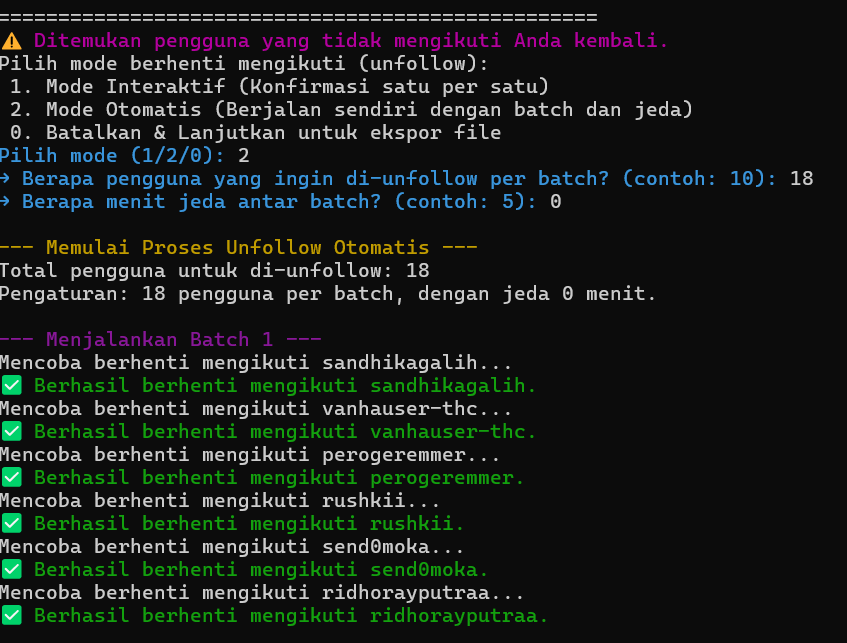

# GitHub Unfollowers

[](https://opensource.org/licenses/MIT)
[](https://www.python.org/downloads/)

A powerful and user-friendly command-line tool to manage your GitHub social connections. This script helps you identify and unfollow users who don't follow you back, with both interactive and automated modes to suit your needs.

**If you find this project useful, please consider giving it a ⭐ star!**

## ⚠️ A Note on Safety

This tool automates actions on your GitHub account via the official API. It is built with safety in mind, incorporating randomized delays to mimic human behavior and respect API rate limits.

However, **this tool is very safe if you use it wisely**. Aggressive or excessive use (e.g., unfollowing hundreds of users in a very short time) could still be flagged by GitHub's automated systems. For the safest experience, it is recommended to use sensible batch sizes and adequate cooldown periods in the automated mode. The developer is not responsible for any actions taken on your account.

## ✨ Features

-   **Identify Non-Followers**: Quickly scans your following and followers lists to find users who do not follow you back.
-   **Interactive Mode**: Unfollow users one-by-one with a clear confirmation prompt for each action, giving you full control.
-   **Automated Batch Mode**: Unfollow users automatically in sessions. You can configure the number of users per session and the cooldown period between sessions to avoid hitting API rate limits.
-   **API Safe**: Uses built-in, randomized delays between actions to mimic human behavior and respect GitHub's API policies.
-   **Secure**: Your personal access token is stored locally in a `.env.local` file and is never exposed in the code.
-   **User-Friendly Interface**: A clean, colorful, and informative command-line interface guides you through every step.

## 📸 Preview



## 🚀 Getting Started

Follow these instructions to get the project up and running on your local machine.

### Prerequisites

-   [Python](https://www.python.org/downloads/) (version 3.7 or higher)
-   [Git](https://git-scm.com/downloads/)

### 🛠️ Installation & Setup

1.  **Clone the repository:**
    Open your terminal or command prompt and run the following command:
    ```sh
    git clone [https://github.com/Nhazlipse/BOT-UNFOLLOW-GITHUB.git](https://github.com/Nhazlipse/BOT-UNFOLLOW-GITHUB.git)
    ```

2.  **Create a virtual environment (Recommended):**
    This keeps your project dependencies isolated.
    ```sh
    # For macOS/Linux
    python3 -m venv venv
    source venv/bin/activate

    # For Windows
    python -m venv venv
    .\venv\Scripts\activate
    ```

3.  **Install dependencies:**
    The required Python libraries are listed in `requirements.txt`.
    ```sh
    pip install -r requirements.txt
    ```

### ⚙️ Configuration

The script requires your GitHub username and a Personal Access Token (PAT) to function.

1.  **Create the environment file:**
    In the root directory of the project, create a new file named `.env.local`.

2.  **Add your credentials:**
    Open the `.env.local` file and add the following lines, replacing the placeholder values with your actual information:
    ```ini
    GITHUB_USERNAME="your_github_username"
    GITHUB_TOKEN="your_personal_access_token"
    ```

3.  **How to get a Personal Access Token (PAT):**
    -   Go to **[GitHub's Personal Access Tokens settings page](https://github.com/settings/tokens/new)**.
    -   Give your token a descriptive name (e.g., "Unfollow Script").
    -   Set an expiration date for the token.
    -   Under **"Repository access"** or **"Select scopes"**, you must check the **`user:follow`** scope. This permission is required to modify your follow relationships.
    -   Click **"Generate token"**.
    -   **Important:** Copy the generated token immediately and paste it into your `.env.local` file. You will not be able to see it again after you leave the page.

## ▶️ How to Use

Once you have completed the installation and configuration steps, you can run the bot with a simple command:

```sh
python main.py
```

The script will launch, display the main banner, and analyze your account. If it finds users who don't follow you back, it will present you with a menu to choose your next action:

Interactive Mode: Confirms every single unfollow action.
Automatic Mode: Asks for session size and delay time, then runs on its own.
Exit: Cancels the operation without unfollowing anyone.

📜 License
This project is licensed under the MIT License. See the LICENSE file for details.

©️ Copyright
Copyright (c) 2025 nhazlipse. All Rights Reserved.
